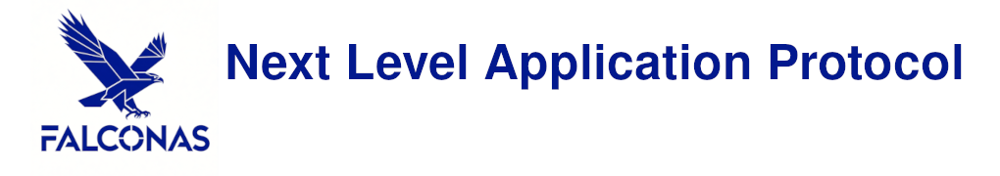

Falcon Application Server - NLAP (Next Level Application Protocol)

---

# 1. Overview

An advanced architectural paradigm for *low-latency* **TCP**/IP transport tailored for
modern browser web-applications and high-throughput data aggregation middleware.

It incorporates a high-speed *Python 3* or *Java* application server that natively utilizes
NLAP as its core transport protocol to minimize execution and scheduling overhead.

# 2. Project Evolution & History

The project was originally conceptualized under the designation `HTTP/1.2`. The initial
objective was to mitigate the limitations of the flawed `HTTP/1.1` pipelining specification
by injecting unique **UUIDs** into individual requests.

However, practical implementation demonstrated that this approach introduces severe
technical problems. 

Because the `HTTP/1.1` specification relies strictly on synchronous, serial processing,
it remains fundamentally incompatible with modern, deterministic zero-latency architectures.
Consequently, the `HTTP/1.2` pipelining methodology was deprecated in favor of a novel
architectural framework: **NLAP**.

# 3. What is NLAP? What problems does NLAP solve?

NLAP (Next Level Application Protocol) is a deterministic, transaction-oriented transport
framework that formally resolves long-standing architectural omissions in Layer 5 (Session)
and Layer 6 (Presentation) of the OSI model over standard TCP. Originally conceptualized by
IETF engineers as an in-kernel transactional framed protocol, NLAP realizes this design paradigm
in user space while maintaining full compatibility with standard `TCP_STREAM` sockets.

By replacing traditional, continuous stream-based processing with discrete, strictly validated
XML message frames, NLAP achieves exceptional throughput, structural security, and minimal
latency.

**Core Architectural Characteristics:**

- **Strict XML Message Framing:** Eliminates stream-parsing ambiguities by processing strictly bounded data packets. This non-streamed approach significantly enhances parsing security, mitigates memory-corruption vectors, and maximizes raw processing performance.
- **Formalized Model Descriptions:** Reduces protocol complexity to a bare minimum by enforcing a 100% complete structural and semantic definition via Document Type Definitions (DTD) and YANG modeling schemas.
- **Granular Protocol Sub-typing:** Sub-divides transport traffic into distinct, functional protocol variants to maximize scalability and simplify network firewalls (see chapter [7. NLAP Subtypes](#7--nlap-subtypes)).
- **Simplified High-Integrity Cryptography**: Drastically reduces cryptographic complexity. Because data is processed as static, complete messages rather than continuous streams, the entire frame is signed and encrypted atomically. This enables hardware-native X.509 standard compliance with direct HSM and TPM integration without complex TLS state-machines.
- **End-to-End Non-Blocking Architecture:** Features non-blocking execution primitives across all protocol layers. This design integrates seamlessly with Linux Kernel 7.0 AccECN (Accurate ECN) to optimize TCP retransmission timeouts (RTO) and low-latency feedback loops.
- **Near-Kernel Latency & Zero HoL Blocking**: Inherently eliminates head-of-line (HoL) blocking over a single socket connection. By deploying hybridized io_uring and epoll I/O frameworks, NLAP achieves deterministic processing speeds that mirror kernel-level transport latencies.

# 4. Achievements

The technical progression and current state of the NLAP implementation comprise the following structural phases and components:

1. **Protocol Paradigm Validation:** Analytical evaluation of HTTP/1.1 pipeline extensions resulted in the complete deprecation of stream-oriented processing for the FalconAS architecture in favor of a transactional framework.
2. **I/O Subsystem Evaluation:** Systematic review of synchronous Berkeley Sockets and multi-threaded processing layouts identified critical architectural bottlenecks, leading to the rejection of traditional multi-threading paradigms.
3. **Reference Socket Specification:** Formulated and published a verified, non-blocking, and deterministic Berkeley Sockets blueprint on *Der IT Prüfer* ([Technical Insight](https://www.der-it-pruefer.de/network/Network-Sockets-Insight)).
4. **Cross-Platform Verification:** Demonstrated the portability of the socket layer by adapting the core FalconAS network-handling runtime to resource-constrained environments, utilizing the ESP32-S3 microcontroller as a reference platform.
5. **C++23 Parsing Library:** Engineered a specialized, performance- and heap-optimized C++23 validation library for low-level HTTP/1.1 parsing and message generation.
6. **Architectural Refactoring:** Executed a comprehensive code-base refactoring based on the empirical performance metrics gathered from the initial reference implementations.
7. **Schema Implementation:** Developed the comprehensive structural boundaries for all NLAP protocol subtypes, formalized through complete Document Type Definitions (DTD) and YANG modeling layouts compiled with AI assistance.
8. **Zero-Copy XML Parsing Engine:** Implemented a memory-optimized XML parsing layer utilizing C++23 features (`std::generator`) and non-allocating string views (`std::string_view`) to minimize data-handling overhead, developed with AI assistance.

# 5. Working Components

Below is a brief overview of the currently functional and production-ready components:

- **Memory (heap)-optimized HTTP/1.1 library:** Features a fast parser and message generator ([/lib/http/](`/lib/http/`)).
- **Microcontroller portability:** The HTTP/1.1 parser library is fully ported to the ESP-IDF based ESP32-S3 and ESP32-C3 platforms (`/ports/arduino/`).
- **Structural specifications:** Includes core XML and workflow schemas formalized via DTD and YANG models (`/specs/`).
- **Optimized XML processing:** A memory-optimized Apache Xerces-based parser tailored for NLAP validation and message processing.

# 6. Milestones

The following developments are scheduled for immediate implementation:

- **Kernel I/O Integration:** Adaptation of Linux `io_uring` (for asynchronous zero-copy receiving and sending) and `epoll` (restricted to transmission operations), adhering to the architectures validated in sections 4.2, 4.3, and 4.4.
- **NLAMP Prototype:** Initial development of the Application Server Metadata ("M") prototype, featuring process-based Shared Memory (SHM) isolation within *FalconAS*.
- **NLAFP Prototype:** Initial development of the File-Transport ("F") prototype, utilizing high-speed, direct user-space I/O.
- **NLAPS Integration:** Full architectural implementation of the ("S") Security Extensions layer.

# 7. NLAP Subtypes

Each NLAP sub-protocol operates on a dedicated TCP port and is structured as follows:

- **NLAFP:** File-transport operations.
- **NLAMP:** Application server Metadata (JSON) exchange.
- **NLAPP:** Upcoming Proxy Server implementation, featuring auto-scaling and multi-endpoint support.
- **NLAPS:** Security Extensions, handling cryptographic signing, encryption, and authentication.

Detailed specifications for each sub-protocol are available in the `/specs` directory.
