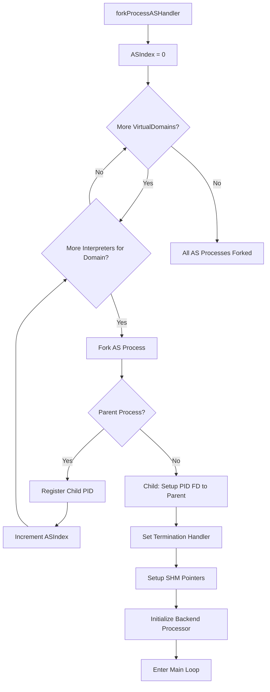
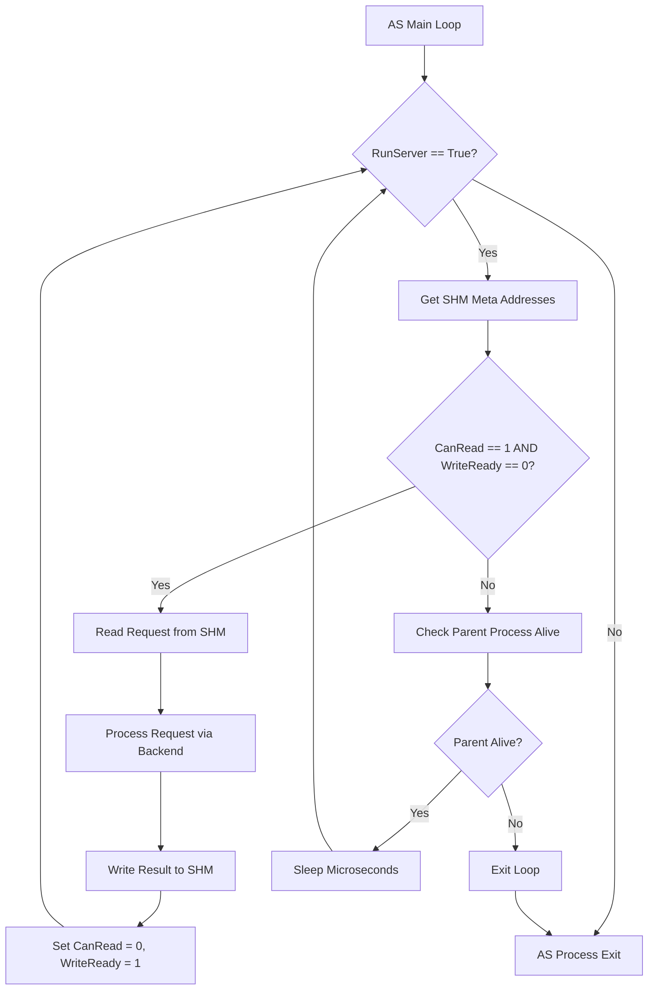

# 1. Application Server Process Handler

The Application Server Process Handler manages:

- Setup Application Server Processes / Instances (fork)
- SHM Requests / Synchronization for all AS Instances
- SHM Writes / Synchronization for all AS Instances

## 1.1. Program Logic

### 1.1.1. Initialization

```c++
ASIndex = 0
- Loop on Config::VirtualDomains
  - Loop on VirtualDomain::ASCount
    - Fork AS[Index] Process / SHM Reference
    - Index++
```

#### 1.1.1.1. ASProcessHandler Initialization Workflow



### 1.1.2. Main Loop

```c++
- Loop
  - Check CanRead == 1 && WriteReady == 0
    - If yes: Process Python Request
    - Write CanRead == 0 && WriteReady = 1
```

#### 1.1.2.1. ASProcessHandler Main Loop Workflow


