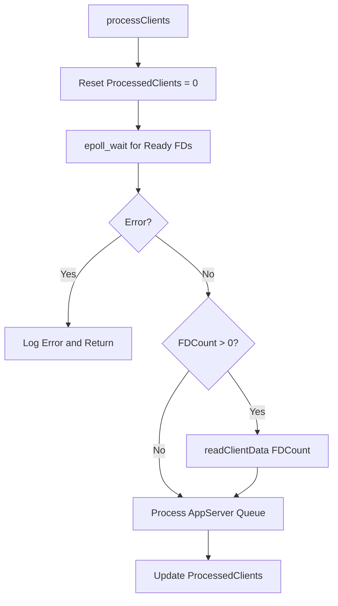
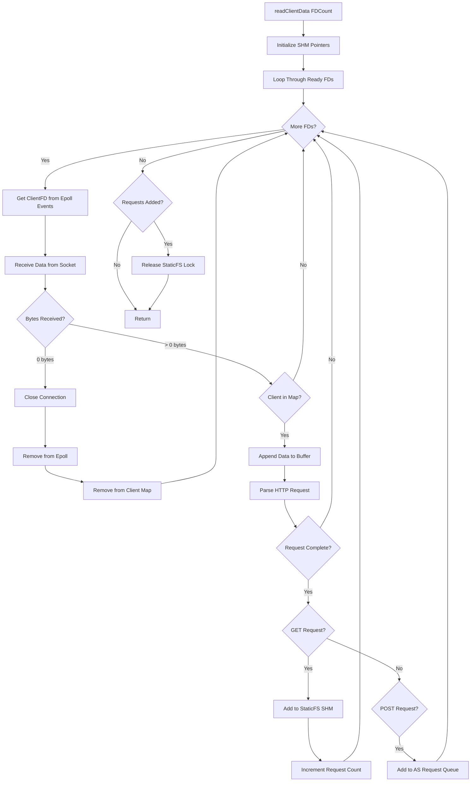

# 1. Client Handler

The ClientHandler Component handles Client Sockets / Epoll Setup / Data Buffering.

## 1.1. Program Logic

### 1.1.1. Add Client

Called from Main::Server on new Client Socket.

- Insert ClientObject with ClientFD as Key into internal C++ Map
- Add ClientFD to Kernel Epoll

#### 1.1.1.1. Add Client Workflow

```mermaid
flowchart TD
    A[addClient ClientFD] --> B[Set Socket Non-blocking]
    B --> C[Create HTTPParser Object]
    C --> D[Insert Client to Map]
    D --> E[Setup Epoll Event EPOLLIN|EPOLLET]
    E --> F[Add FD to Epoll]
```

### 1.1.2. Process Clients

Get all Epoll FDs with waiting data.

> If 5000 current Clients are connected and 2000 have waiting buffered data, we get an
Array of these 2000 Filedescriptor integers.

Process all Filedescriptors calling readClientData().

#### 1.1.2.1. Process Clients Workflow



### 1.1.3. Read Client Data

Process all Filedescriptors with waiting data.

- Close connection when connection-close (0 Bytes received) on Socket Level
- If Filedesriptor in Client Map found, append received data to Client Objects Buffer
- Parse Request Basic Data, if non-fragmented add to SHM buffer
- If Clients with data exist, release SHM StaticFS Lock to process

#### 1.1.3.1. Read Client Data Workflow


