# 1. Graphical Workflows

This document contains all graphical workflow diagrams extracted from the specification documents.

## 1.1. Application Server Process Handler Workflows

### 1.1.1. ASProcessHandler Initialization Workflow

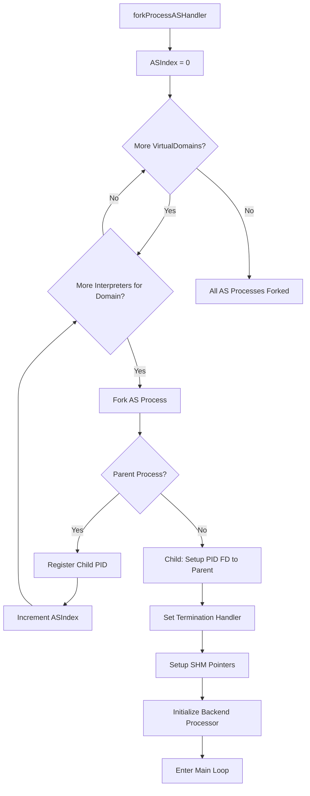

### 1.1.2. ASProcessHandler Main Loop Workflow

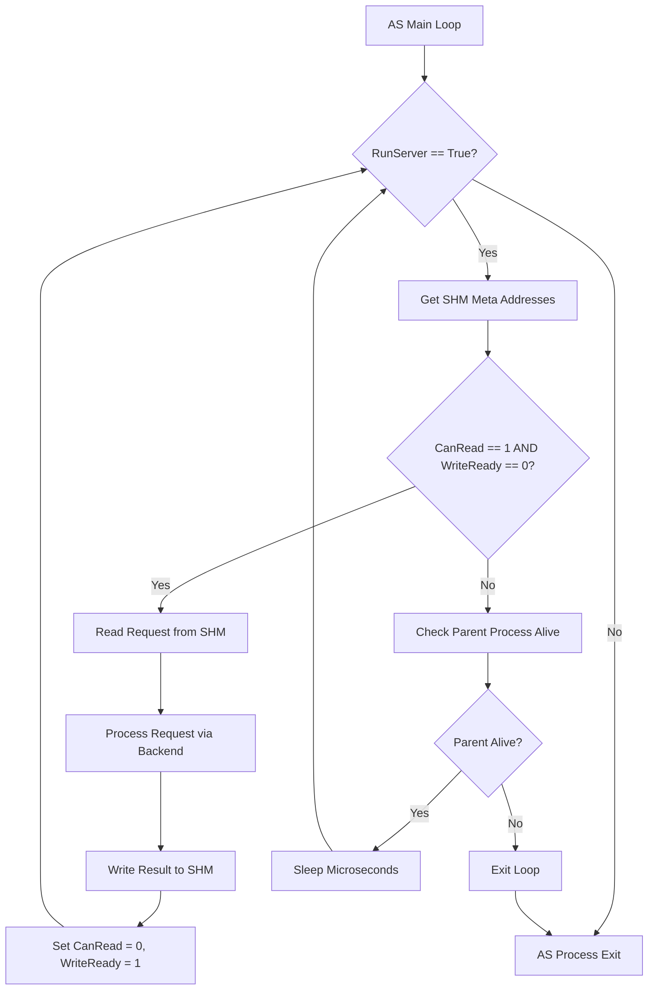

## 1.2. Client Handler Workflows

### 1.2.1. Add Client Workflow

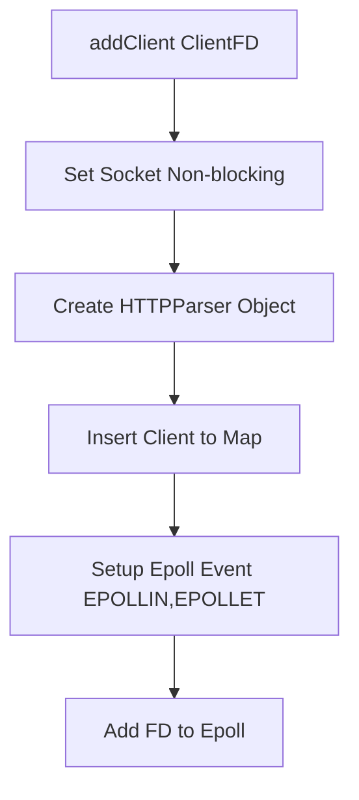

### 1.2.2. Process Clients Workflow

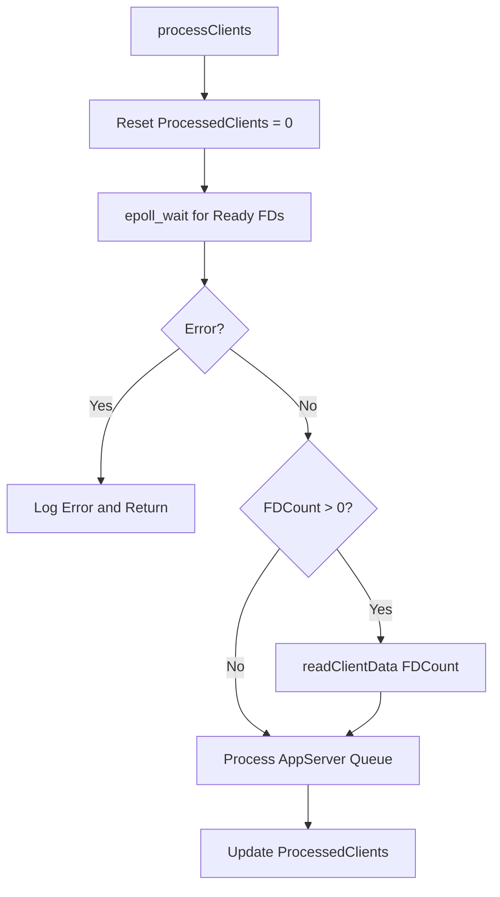

### 1.2.3. Read Client Data Workflow

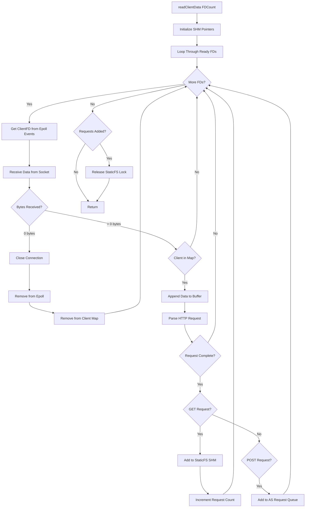

## 1.3. Main Server Workflows

### 1.3.1. Server Initialization Workflow

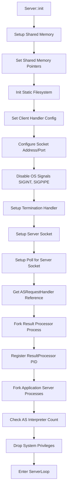

### 1.3.2. ServerLoop Workflow

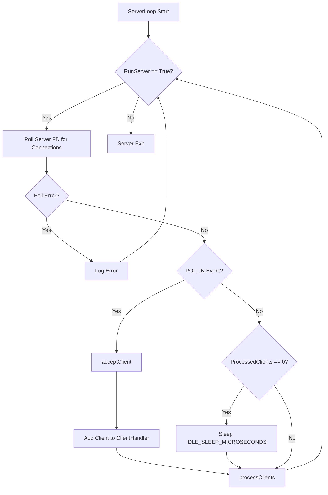

## 1.4. Result Processor Workflows

### 1.4.1. Read StaticFS Requests Workflow

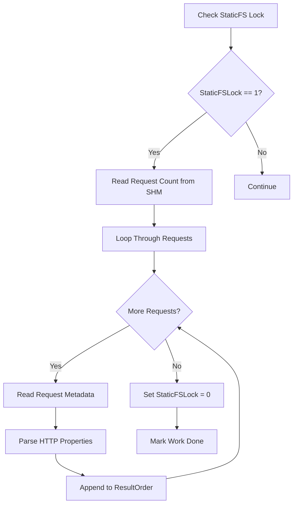

### 1.4.2. Read AS Results Workflow

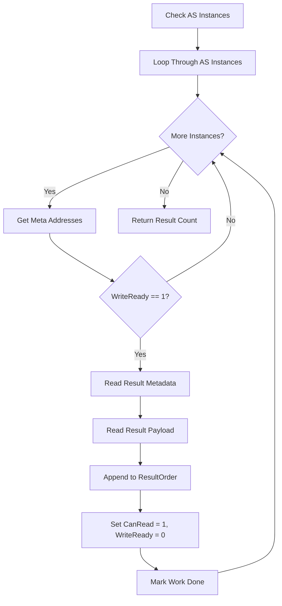

### 1.4.3. ResultProcessor Main Loop Workflow

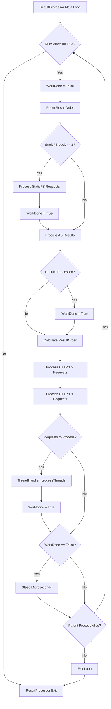

### 1.4.4. ThreadHandler Process Workflow

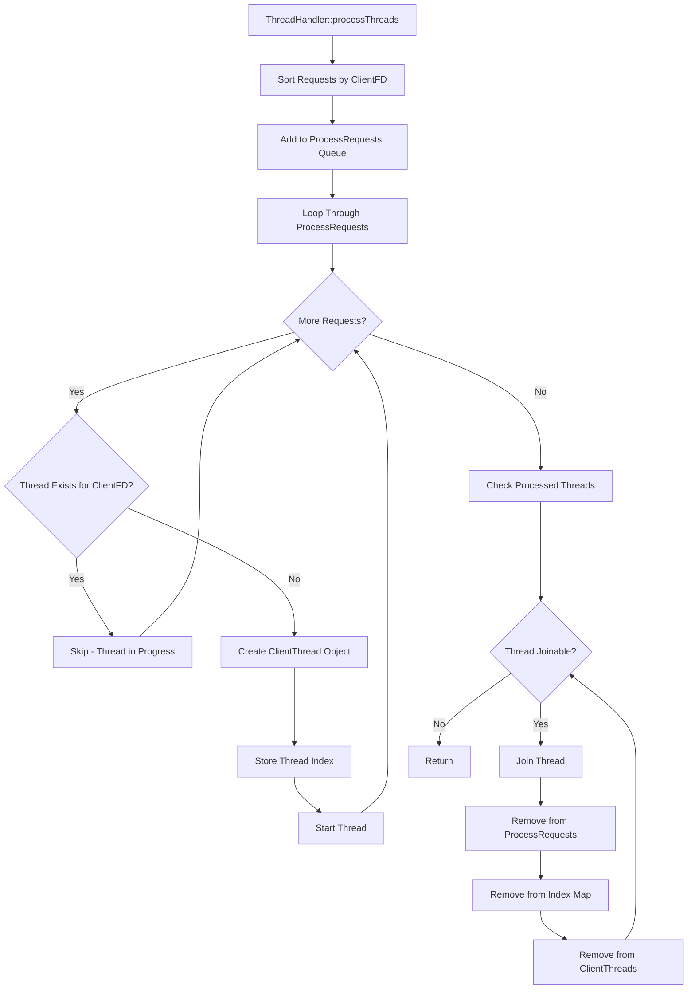

### 1.4.5. ClientThread Processing Workflow

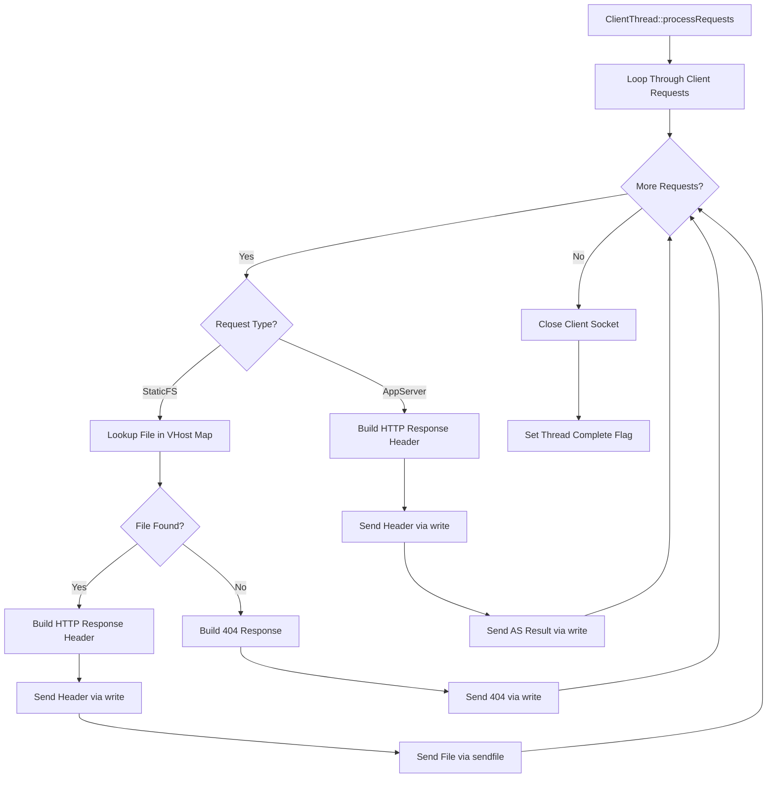
