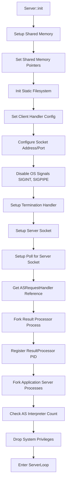
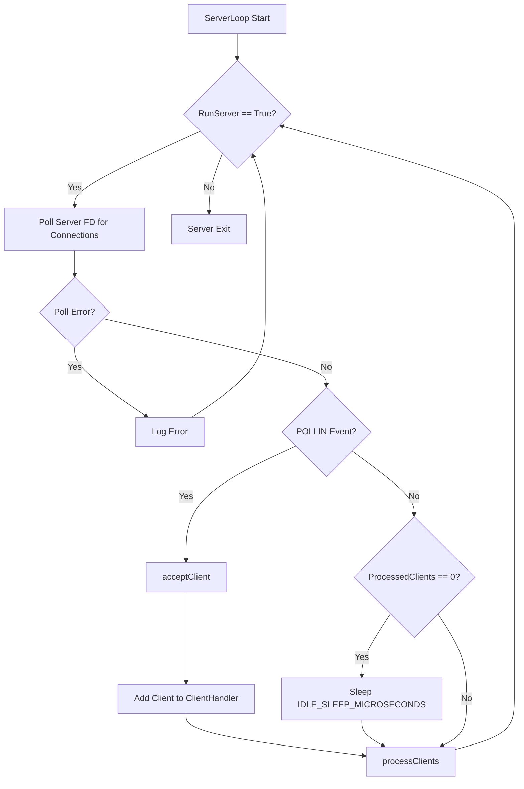

# 1. Main Server

The Main Server Process initializes all components on startup using configuation from
XML Configuration file.

## 1.1. Program Logic

### 1.1.1. Initialization

- Setup Shared Memory Segments
- Disable Signals / Setup Termination Handling
- Setup Server Listening Socket / Poll for Server Socket Filedescriptor
- Load / Init StaticFS recursive Filesystem Snapshot for each Virtual Host
- Init AS Handler Process (Fork all Application Server Processes)
- Init Result Processor (Fork Result Processor Process)
- Setup Connection Handler Instance
- Drop System Privileges
- Enter Server Loop

#### 1.1.1.1. Server Initialization Workflow



### 1.1.2. Main Loop

```c++
- While Static::RunServer is True
  - Check for Socket Accept Client (New Connection)
    - Add Client FD to Connection Handler
  - Process Clients with waiting data (Connection Handler Method)
```

#### 1.1.2.1. ServerLoop Workflow


