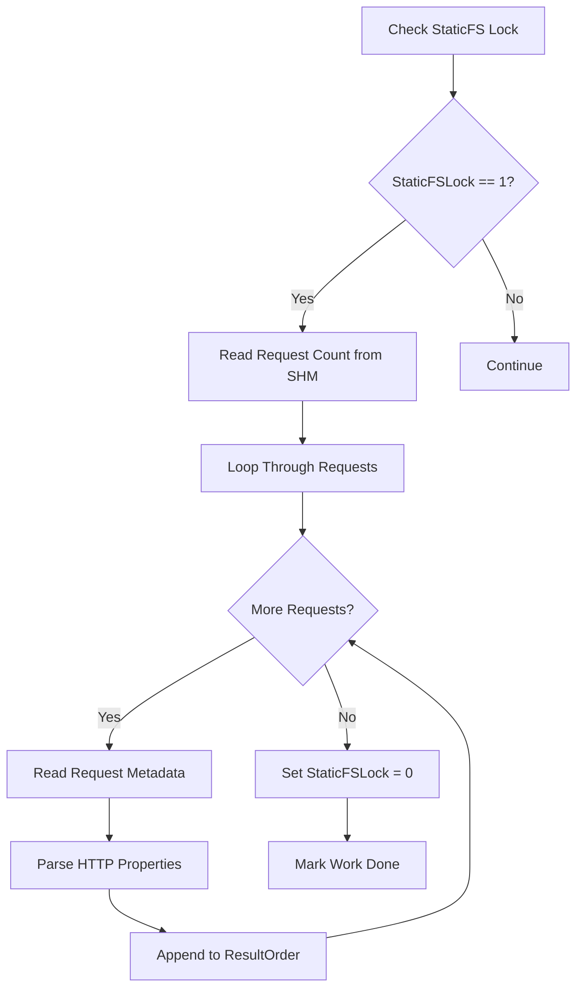
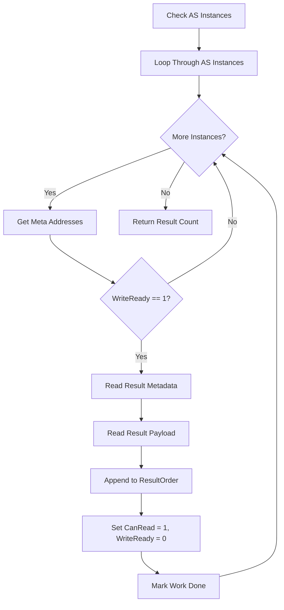
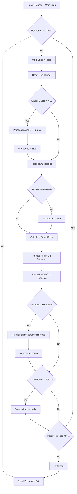
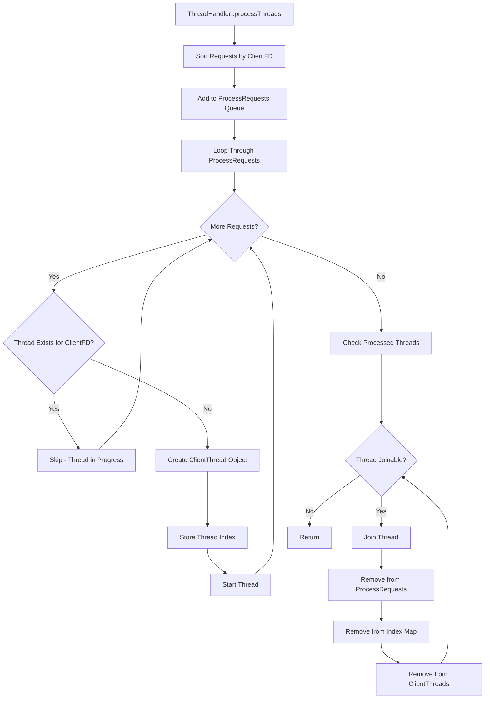
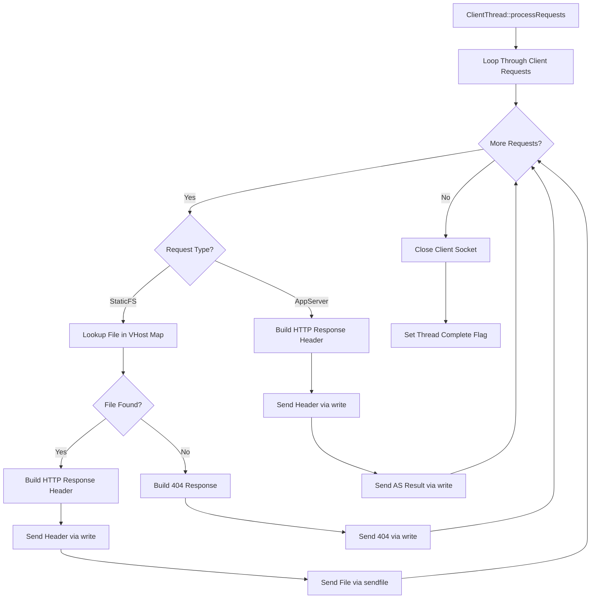

# 1. Result Processor

The Result Processor manages the following tasks:

- Check / Read StaticFS Requests
- Check / Read AS POST Results
- Result Send Thread Processor

## 1.1. Read StaticFS Requests

If Lock::get_read_data (Server Main Loop) == 1, SHM Data with StaticFS requests is ready to read.

Loop on all GET requests and feed into `ResultProcessor::ResultOrder::appendData(ClientFD, DataPointer)`.

### 1.1.1. Read StaticFS Requests Workflow



## 1.2. Read AS Results

Check all AS Instances if WriteReady == 1.

If WriteReady == 1 (Existing result):

- `ResultProcessor::ResultOrder::appendData(ClientFD, DataPointer)`
- Reset AS Instance Properties to default (CanRead == 1, WriteReady = 0)

### 1.2.1. Read AS Results Workflow



## 1.3. Result Scheduler

Result for HTTP/1.1 must be synchronous / ordered.

Result Scheduler Class definition see: [ResultScheduler.md](./ResultScheduler.md)

## 1.4. Main Loop

Main Loop Layout.

```bash
loop:

  workdone = 0

  - if StaticFSLock == 1
      append GET static FS requests into ResultProcessor::ResultOrder
      StaticFSLock = 0
      workdone = 1
  - get_post_results()
      if AS::Index1::WriteReady == 1
        append POST result into ResultProcessor::ResultOrder::appendData(ClientFD, DataPointer)
        set CanRead = 1, WriteReady = 0
        workdone = 1
      if AS::IndexX::WriteReady == 1
        append POST result into ResultProcessor::ResultOrder::appendData(ClientFD, DataPointer)
        workdone = 1
        set CanRead = 1, WriteReady = 0
  - if fds_to_process
      ThreadProcessor::processThreads
      workdone = 1

  - if workdone == 0:
    sleep Config::Microseconds
```

### 1.4.1. ResultProcessor Main Loop Workflow



### 1.4.1. On Idle

If workdone == 0 (no work done), micro-sleep.

## 1.5. Result Send Thread Processor

```bash
+-------------+-----------+------------------------------+
| ClientFD    | RequestNr | Request                      |
+-------------+-----------+------------------------------+
| 212         | 1         | GET /bla/one.jpg             |
+-------------+-----------+------------------------------+
| 212         | 2         | GET /bla/two.jpg             |
+-------------+-----------+------------------------------+
| 212         | 3         | GET /bla/one.html            |
+-------------+-----------+------------------------------+
| 403         | 1         | GET /bla/one.jpg             |
+-------------+-----------+------------------------------+
| 403         | 2         | GET /bla/two.jpg             |
+-------------+-----------+------------------------------+
| 403         | 3         | GET /bla/one.html            |
+-------------+-----------+------------------------------+
| 403         | 4         | POST /test.py                |
+-------------+-----------+------------------------------+
```

### 1.5.0. ThreadHandler Process Workflow



### 1.5.1. Thread 1 (detached)

Thread 1 will sendfile() three results to ClientFD 212 socket.

```bash
+-------------+-----------+------------------------------+
| ClientFD    | RequestNr | Request                      |
+-------------+-----------+------------------------------+
| 212         | 1         | GET /bla/one.jpg             |
+-------------+-----------+------------------------------+
| 212         | 2         | GET /bla/two.jpg             |
+-------------+-----------+------------------------------+
| 212         | 3         | GET /bla/one.html            |
+-------------+-----------+------------------------------+
```

Thread sets terminate flag to 1 after execution and waits to be terminated.

#### 1.5.1.1. ClientThread Processing Workflow



### 1.5.2. Thread 2 (detached)

If AS result has been processed in time, Thread2 will sendfile() the first 3 results and
afterwards write() the AS result to ClientFD 403 socket.

```bash
+-------------+-----------+------------------------------+
| ClientFD    | RequestNr | Request                      |
+-------------+-----------+------------------------------+
| 403         | 1         | GET /bla/one.jpg             |
+-------------+-----------+------------------------------+
| 403         | 2         | GET /bla/two.jpg             |
+-------------+-----------+------------------------------+
| 403         | 3         | GET /bla/one.html            |
+-------------+-----------+------------------------------+
| 403         | 4         | POST /test.py                |
+-------------+-----------+------------------------------+
```

Thread sets terminate flag to 1 after execution and waits to be terminated.
